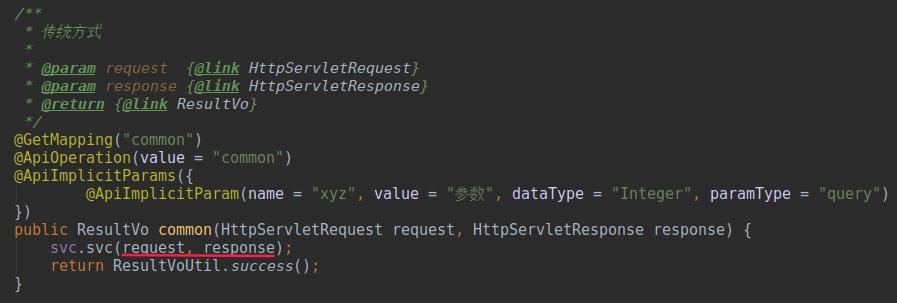
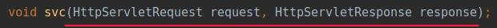
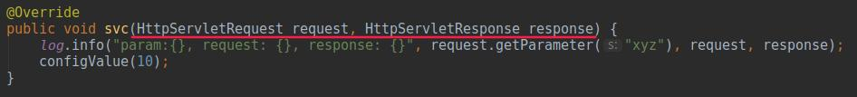
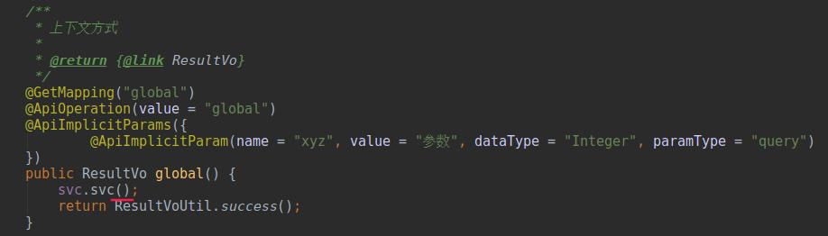
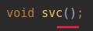
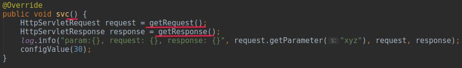
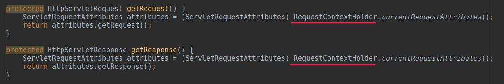

### 1. 参数传递方式

* 传统方式
1. 对外接口层(controller)定义request/response参数,传递至需要使用的方法
 

2. 服务层接口需要定义参数
 

3. 实现层使用传递的参数
 

* 上下文方式
1. 对外接口层(controller)无需定义
 

2. 服务层接口不需要定义传递
 

3. 实现层使用上下文方式获取request/response
 

4. 项目中提取为公共代码,是用RequestContextHolder方式获取
 

